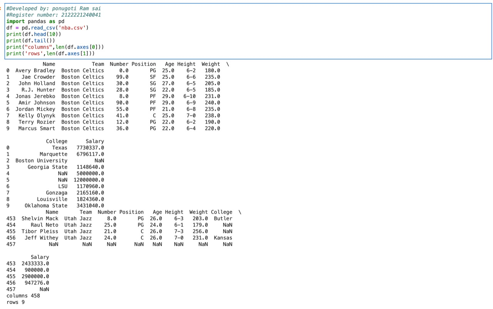

# Read-from-CSV

### AIM:
To write a program to read from csv

### ALGORITHM:
## Step 1:
load the csv into a data frame

## Step 2:
print the number of contents to be displayed using df.head()

## Step 3:
the number of rows returened is defined in pandas option settings

## Step 4:
check your systems maximum colum with the pd.options.display.max_colums statement

## Step 5:
increase the maximum number of rows to display the entire data frame

### PROGRAM:
~~~
##Developed by : P.Ramsai
##Reg.no : 21000888
~~~
```
import pandas as pd
df = pd.read_csv('nba.csv')
print(df.head(10))
print(df.tail())
print("Column",len(df.axes[0]))
print("Row",len(df.axes[1]))
```
## OUTPUT:


## RESULT:
Therefore the program is successfully executed to read csv file and access the data in it.
